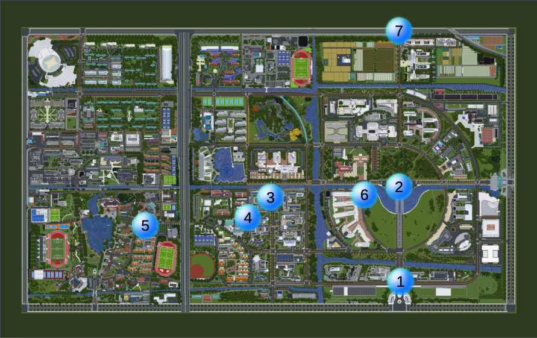
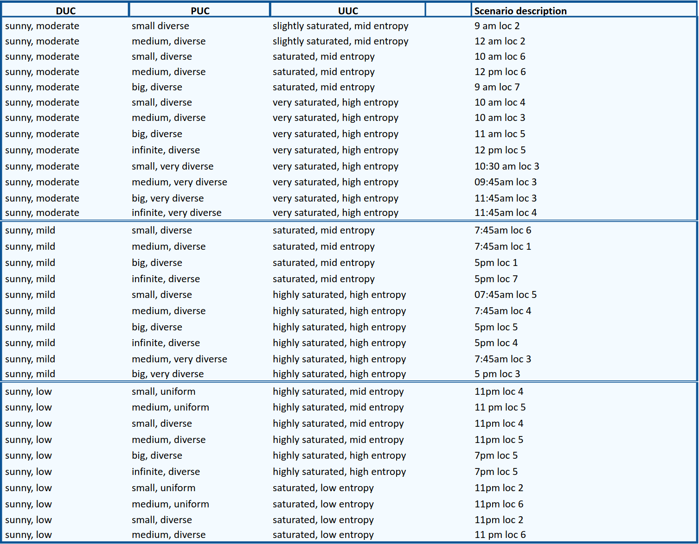

Framework
===================

Introduction
^^^^^^^^^^^^

   In order to achieve an easily understandable and replicable standard for use case definition in the field of system automation, a discrete classification framework design approach was designed. It counts with its own logic to map the different use cases that can be found in different fields, which allows the user to categorize environmental factors, participant characteristics, and structural conditions into explicit symbolic states in scenarios that can be described consistently, compared reliably, and replicated across different contexts. This discrete structure also simplifies interpretation and supports the creation of a standardized logic that can be applied to a wide range of automation systems.

   .. figure:: _static/graph.png

   - **Data use case (DUC)**: 
     It captures the environmental and technical conditions that influence the execution of a use case.

   - **Participants use case (PUC)**:
     It represents the entities interacting with the use case, focusing on their scale and composition.

   - **Structure use case(UUC)**:
     It defines the organizational and contextual characteristics of the environment in each use case setting.

Application of the framework in our smart data field
^^^^^^^^^^^^^^^^^^^^^^^^^^^^^^^^^^^^^^^^^^^^^^^^^^^^^

   Based on the given categories, we create new sub-branches so that we can get more information on how the environmental factors that
   surround the system behaves.

   In the case of autonomous cars, the sub-categories can be framed in the following way:

   - **DUC**
      - Weather (rainy, foggy, sunny)

      - Light (none, low, mild, moderate, strong)

      - Sensor state: A list of dictionary values with sensor information

         - ID (unique)
         - Type of sensor (velodyne, lsLiDAR, RSLiDAR, etc.)
         - Obstructed (false, true)
         - Sensor count (1,2,3,4,5, etc.)

        *Notes*

        - The number of sensors is the calculation of the count of sensors in the system.

        - When a sensor is removed, its ID cannot be used again.

        - In the casea sensor was removed and added again, it would automatically be assigned a new ID.
   
   - **PUC**
      - Size (null, small, medium, big, infinite)
      - Uniformity (uniform, diverse, very diverse, infinite)

   - **UUC**
      - Environment (not saturated, slightly saturated, saturated, very saturated): The number of elements to analyze.
      - Chaos (Low entropy, middle entropy, high entropy): Associated to participants and their dynamic behavior.

Use cases in the context of SJTU's autonomous car
^^^^^^^^^^^^^^^^^^^^^^^^^^^^^^^^^^^^^^^^^^^^^^^^^^^^^

Based on this framework, Fusion Labs has created a dataset with different types of use cases that can be found in Shanghai Jiao Tong University's Minhang Campus. 

Each theoretical use case is mapped to specific locations and time periods within the campus where the scenario is most likely to occur.

After data collection, the actual use cases present in the dataset are identified and linked to the corresponding segments of recorded data.  
By comparing theoretical and real use cases, missing scenarios and estimation errors can be identified.

This difference is then used as feedback to refine and update the theoretical use case design for the next iteration of data collection.

In the following image, we can on which areas of the university were chosen to collect information for the purposes of this project:

The use cases in question can be found in the following shape:

Limitations
^^^^^^^^^^^

The enviroment under which the data was collected has limited the definition of certain types of use cases, as the information that could be collected depends on the daily life in the campus (which means that different settings such as highways and urban areas were inevitably left out) and hardware limitations (such as capturing data under rainy weather, as the car is not waterproof, and foggy weather, because such weather is uncommon in Shanghai).

